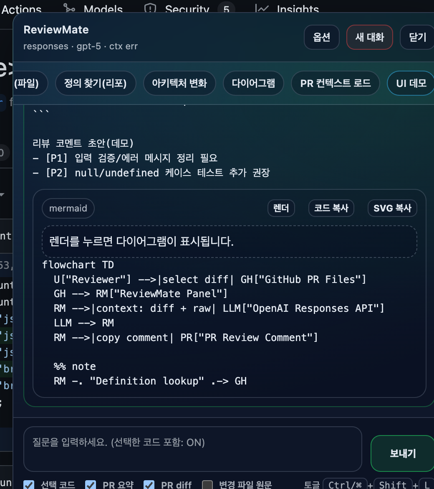
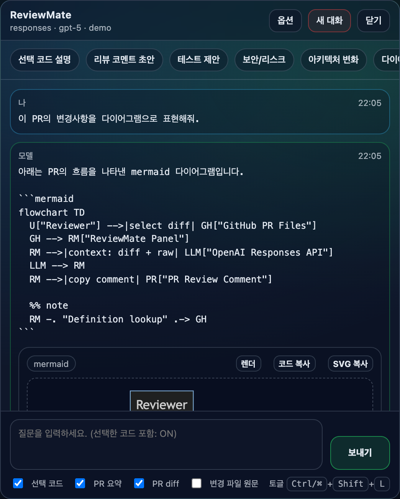
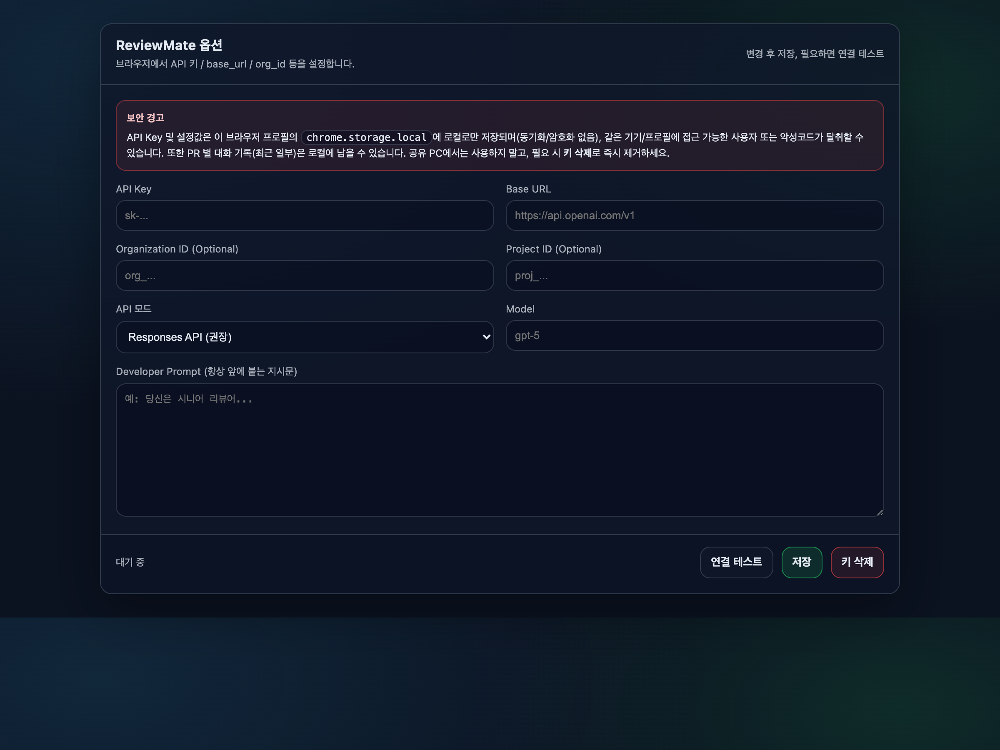
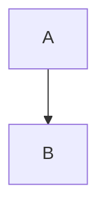

# ReviewMate (Chrome Extension)

GitHub Pull Request 리뷰 화면(특히 **Files 탭**)에서 선택한 코드/PR 컨텍스트를 바탕으로, 브라우저 안에서 LLM과 질의응답하며 리뷰 퀄리티를 높이는 크롬 확장프로그램입니다.

## Screenshots







## 주요 기능

- GitHub PR 화면에 떠있는 ReviewMate 패널(RM 버튼)에서 바로 채팅
- PR 컨텍스트 자동 수집(선택/PR 요약/PR diff/변경 파일 원문 일부) + 컨텍스트 토글
- GitHub 로그인 세션 기반으로 PR/파일을 가져옴 (별도 GitHub PAT `ghp_...` 불필요)
- 정의 찾기(파일/리포): 선택한 식별자의 선언 후보를 스니펫으로 빠르게 확인
- Mermaid 코드블록(````mermaid`)을 **SVG로 렌더링**해서 패널에서 바로 다이어그램 확인/복사
- OpenAI 호환 API: `base_url`/`org_id`/`project_id` 설정 + 스트리밍 응답
- `<all_urls>` 없이, **base_url 도메인만 런타임 권한으로 요청**

## 설치(개발용, Load Unpacked)

1. 이 리포를 로컬에 받기
2. Chrome 주소창에 `chrome://extensions`
3. 우측 상단 `Developer mode` 활성화
4. `Load unpacked` 클릭
5. 이 프로젝트 폴더( `manifest.json` 이 있는 폴더)를 선택

## 최초 세팅(LLM 설정)

1. ReviewMate 옵션 열기
   - `chrome://extensions` > ReviewMate `Details` > `Extension options`
   - 또는 GitHub PR 화면에서 패널 우측 상단 `옵션`
2. 아래 항목 입력 후 `저장`
   - `API Key`: OpenAI API 키
   - `Base URL`: 예) `https://api.openai.com/v1` (끝의 `/`는 자동 정규화)
   - `Organization ID` / `Project ID`: 필요 시만
   - `API 모드`: `Responses API`(권장) 또는 `Chat Completions`
   - `Model`: 예) `gpt-5`
   - `Developer Prompt`: 리뷰 톤/규칙을 고정하고 싶을 때
3. 저장/테스트 시, Chrome이 **Base URL 도메인에 대한 호스트 권한**을 요청합니다.
   - 예: `https://api.openai.com/*`
   - 거절하면 LLM 호출이 차단됩니다(권한 최소화를 위한 설계).
4. 필요하면 `연결 테스트`로 `/models` 호출이 되는지 확인

## 사용법(GitHub PR 리뷰)

1. GitHub PR의 Files 탭 열기: `https://github.com/<owner>/<repo>/pull/<n>/files`
2. 우측 하단 `RM` 버튼을 눌러 패널 열기
3. 코드/텍스트를 드래그로 선택한 뒤 질문(기본: `선택 코드` 토글 ON)
4. 필요에 따라 컨텍스트 토글 조정
   - `PR diff`는 기본 ON (길면 자동 truncation)
   - `변경 파일 원문`은 ON 시 일부 파일 원문을 추가로 수집(파일/총량 제한)
5. 빠른 버튼(선택 코드 설명/리뷰 코멘트 초안/테스트/보안/아키텍처/다이어그램 등)으로 템플릿 프롬프트 사용

단축키

- 패널 토글: `Ctrl+Shift+L` (mac: `Command+Shift+L`)
- 보내기: `Ctrl/⌘ + Enter`

## Mermaid 다이어그램

모델 답변에 아래처럼 `mermaid` 코드블록이 포함되면, 패널에 다이어그램 뷰어가 나타납니다.

````

````

`렌더`를 누르면 로컬에서 SVG로 렌더링하고, `코드 복사`/`SVG 복사`가 가능합니다.

## 보안/주의(중요)

- API Key 및 설정값은 이 브라우저 프로필의 **`chrome.storage.local`에 로컬로만 저장**됩니다. (동기화/암호화 없음)
- PR별 대화 기록(최근 일부)도 로컬에 남을 수 있습니다.
- 같은 기기/프로필에 접근 가능한 사용자 또는 악성코드가 **키/대화를 탈취**할 수 있습니다.
- 공유 PC에서는 사용하지 말고, 필요 시 옵션에서 **`키 삭제`**로 즉시 제거하세요.
- 선택한 코드/PR 컨텍스트가 외부 API로 전송됩니다. 비밀/토큰/개인정보가 포함되지 않도록 주의하세요.

## Troubleshooting

- `Missing host permission: https://.../*`
  - 옵션에서 `저장` 또는 `연결 테스트`를 눌러 권한 요청을 승인하세요.
- 패널 상단에 `ctx err` 표시
  - GitHub 로그인 상태/PR 접근 권한을 확인하고 새로고침 후 다시 시도하세요.
- `정의 찾기(리포)`가 결과가 없거나 부정확
  - GitHub 코드검색 + 간단한 정규식 기반이라 100% 정확하지 않습니다(언어 서버 수준 아님).

## 개발 메모

- `src/content_script.js`: GitHub PR 페이지에 패널 UI 주입 + GitHub 컨텍스트 수집 + Mermaid 렌더링
- `src/service_worker.js`: OpenAI 호환 API 호출/스트리밍(SSE) 처리
- `src/options.html` / `src/options.js`: 설정 저장 + base_url 도메인 런타임 권한 요청/테스트

## Third-Party

- `mermaid@10.9.1` 번들을 포함합니다. 라이선스는 `THIRD_PARTY_NOTICES.md` 참고.
